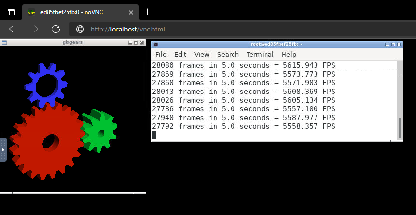
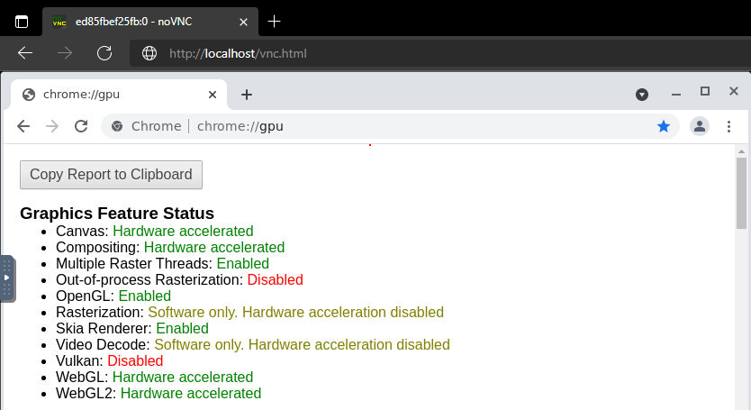

# docker-ubuntu-vnc-desktop-opengl

An Ubuntu container running X11 with OpenGL/WebGL, accessible from a VNC/browser.




## Architecture

* Docker
* NVIDIA Container toolkit
* Xorg
* x11vnc
* noVNC

## Build

Set the GPU driver version of the host OS to `DRIVER_VERSION`.

```
docker-compose build --build-arg DRIVER_VERSION=$(nvidia-smi --query-gpu=driver_version --format=csv,noheader)
```

## Launch

```
docker-compose up
```

Open `:8081/vnc.html` in your browser.

## Config

The following parameters can be set:

* X11VNC_PORT
* NOVNC_PORT
* RESOLUTION

